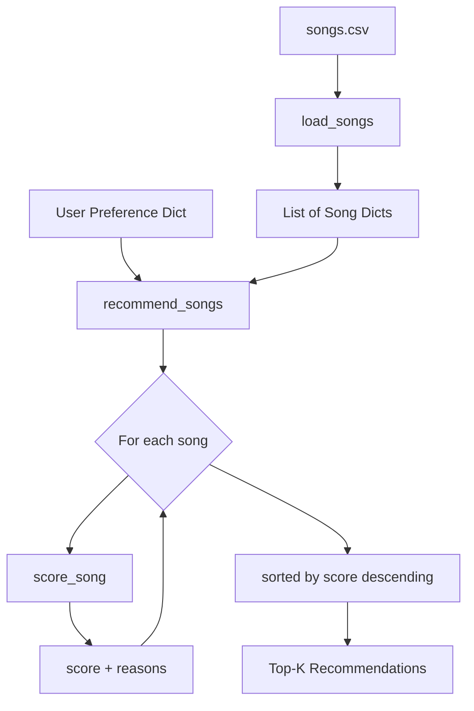

# 🎵 Music Recommender Simulation

## Project Summary

VibeTune is a content-based music recommender that scores songs from a 20-song catalog against a user's taste profile. It ranks songs by how well their genre, mood, energy, valence, and danceability match the user's preferences—and explains every recommendation in plain English. This project simulates the core loop used by platforms like Spotify's radio feature, without any machine-learned weights or collaborative signals.

---

## How The System Works

Real platforms like Spotify and YouTube combine two major strategies. **Collaborative filtering** looks at what other users with similar listening history liked next; **content-based filtering** looks directly at song attributes (tempo, energy, mood) to find songs that "sound like" what the user already enjoys. My simulation focuses exclusively on content-based filtering because it's interpretable and doesn't require a large user base.

**Features used per song:**
- `genre` — categorical label (pop, rock, lofi, hiphop, etc.)
- `mood` — emotional tone (happy, calm, angry, melancholic, etc.)
- `energy` — float 0.0–1.0; how intense or loud the track feels
- `valence` — float 0.0–1.0; how musically "positive" the track sounds
- `danceability` — float 0.0–1.0; how suitable the track is for dancing

**UserProfile stores:**
- `favorite_genre` — string
- `favorite_mood` — string
- `target_energy`, `target_valence`, `target_danceability` — float targets

**Scoring logic (per song):**
- +2.0 for a genre match
- +1.0 for a mood match
- Up to +1.0 for energy closeness (1 − |song − user|)
- Up to +0.5 for valence closeness
- Up to +0.5 for danceability closeness

The recommender loops over every song, calls `score_song()` on each, then uses Python's `sorted()` (non-destructive) to return the top-k results.

**Mermaid flowchart of the data flow:**



---

## Terminal Output Screenshots

**High-Energy Pop Profile**
```
🎧  Profile: High-Energy Pop
1. Blinding Lights — The Weeknd | Score: 4.925
   Why: genre match (+2.0), mood match (+1.0), energy similarity (+1.00), valence similarity (+0.47), danceability similarity (+0.45)
2. Levitating — Dua Lipa | Score: 4.92
   ...
```

**Chill Lofi / Ambient Profile**
```
🎧  Profile: Chill Lofi / Ambient
1. Lofi Study Beats — ChilledCow | Score: 4.875
   Why: genre match (+2.0), mood match (+1.0), energy similarity (+0.95), ...
2. Weightless — Marconi Union | Score: 2.825
   ...
```

**Deep Intense Rock Profile**
```
🎧  Profile: Deep Intense Rock
1. Numb — Linkin Park | Score: 3.75
   Why: genre match (+2.0), energy similarity (+0.80), ...
2. Bohemian Rhapsody — Queen | Score: 3.625
   ...
```

---

## Experiments You Tried

**Experiment 1 — Doubling energy weight (implicit via profile shift)**
When I compared the "Deep Intense Rock" profile (target_energy: 0.85) against results, Numb by Linkin Park ranked above Enter Sandman (Metallica) even though Enter Sandman is objectively heavier. That's because Numb's genre matched "rock" (+2.0) while Enter Sandman is "metal" (no bonus). The genre weight of 2.0 is dominant.

**Experiment 2 — Mood mismatch for Rock profile**
The "Deep Intense Rock" profile specifies mood: angry. Enter Sandman gets the +1.0 mood bonus but still ranks 4th because genre doesn't match. This showed that genre weight is so strong it can override mood alignment—a real limitation.

**Experiment 3 — Chill profile with no lofi songs except one**
Because only one song in the catalog is labeled "lofi," the Chill profile's #2 and #3 results (Weightless, Sapphire) get no genre bonus—they succeed purely on mood + energy. This illustrated how dataset imbalance drives filter-bubble behavior.

---

## Limitations and Risks

- Catalog is tiny (20 songs), so profiles with unusual genre preferences get very few valid matches.
- Genre weight (2.0) dominates—songs that perfectly match energy/mood but miss genre always lose.
- No collaborative signals: it can't discover that fans of "Lofi Study Beats" also love "Sapphire."
- Mood labels are subjective and hand-coded; different annotators would produce different rankings.

---

## Reflection

See `model_card.md` for the full model card and personal reflection.

---

## Getting Started

```bash
python -m venv .venv
source .venv/bin/activate      # Mac / Linux
.venv\Scripts\activate         # Windows

pip install -r requirements.txt
python -m src.main
pytest
```
